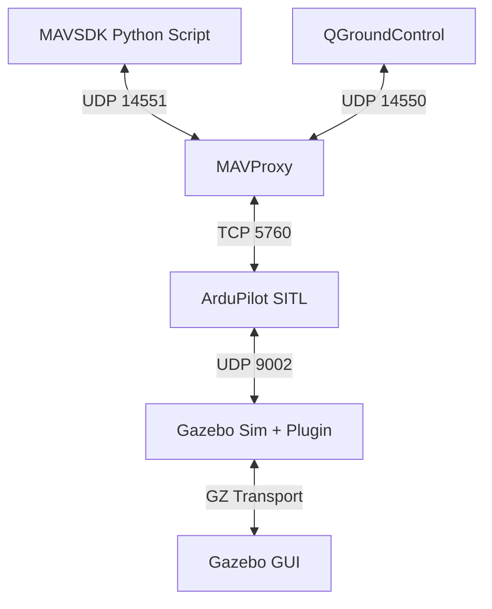

# Architektúra a Nastavenie UAV Drone Research

Tento dokument vysvetľuje vnútorné fungovanie tvojho vývojového prostredia, komunikačné toky a dôležité konštanty.

## 1. Systémová Architektúra & Komunikácia

Celý stack funguje ako distribuovaný systém, kde jednotlivé komponenty komunikujú cez sieťové porty (localhost).

### Komunikačné kanály:
| Port | Protokol | Odosielateľ | Príjemca | Účel |
| :--- | :--- | :--- | :--- | :--- |
| **9002** | UDP | Gazebo Plugin | ArduPilot | Prenos dát zo senzorov a motory. |
| **5760** | TCP | ArduPilot | MAVProxy | Hlavný MAVLink prúd. |
| **14550** | UDP | MAVProxy | QGC | Výstup pre QGroundControl. |
| **14551** | UDP | MAVProxy | MAVSDK | Vyhradený port pre `fly.py`. |
| **5501** | UDP | sim_vehicle.py | ArduPilot | Vnútorný SITL konfiguračný port. |

---

## 2. Kľúčové Nastavenia

### Environmentálne Premenné (v `~/.zshrc`)
Tieto cesty umožňujú Gazebu nájsť tvoj skompilovaný plugin a modely bez toho, aby museli byť v systémových priečinkoch.
- `GZ_SIM_SYSTEM_PLUGIN_PATH`: Smeruje na `~/ardupilot_gazebo_install/lib/ardupilot_gazebo`.
- `GZ_SIM_RESOURCE_PATH`: Smeruje na modely a svety v `~/ardupilot_gazebo_install/share/...`.

### Model SDF (`iris_with_gimbal/model.sdf`)
- **Lock-step (0):** Je vypnutý. Pri hodnote 1 by Gazebo čakalo na ArduPilot pred každým fyzikálnym krokom. Na macOS to často spôsobuje "zmrznutie" simulátora, preto sme ho pre stabilitu vypli.
- **FDM Address (127.0.0.1):** Adresuje lokálny ArduPilot proces.

---

## 3. Postup pri Spúšťaní (Step-by-Step)

### A. Turbo Štart (Odporúčané)
1. Spusti `./start_sim.sh` (otvorí terminály sám).
2. V Gazebo klikni na **Play**.
3. Spusti `./drone_cmd.sh` (nastaví parametre drona).
4. Spusti misiu: `uv run python fly.py`.

### B. Manuálny postup (V prípade potreby)
Vždy dodržiavaj toto poradie:

1. **Čistenie:** `pkill -9 -f "arducopter|gz|sim_vehicle|mavproxy"` (zastaví zaseknuté procesy).
2. **Autopilot (T1):** `sim_vehicle.py -v ArduCopter -f gazebo-iris --model JSON --map --console`
   - V okne MAVProxy zadaj: `param set ARMING_SKIPCHK 64`, `rc 3 1000` a `output add 127.0.0.1:14551`.
3. **Simulačný Server (T2):** `gz sim -s iris_runway.sdf`
4. **Simulačné GUI (T3):** `gz sim -g`
5. **Aktivácia:** V GUI klikni na **Play**.
6. **Misia (T4):** `uv run python fly.py`

---

## 4. Riešenie Problémov (FAQ)
- **"Link is down":** Zvyčajne znamená, že simulácia nie je v stave "Play" alebo nebeží Gazebo Server.
- **"Address already in use":** Iný proces (napr. QGroundControl) blokuje port 14550 alebo 9002. Použi `lsof -i :9002` na nájdenie vinníka.
- **Dron nerobí nič:** Skontroluj, či si v MAVProxy okne (Terminál 1) uvidíš "Arming". Ak nie, pravdepodobne chýba GPS fix (v Gazebo uvidíš drona na asfalte).
